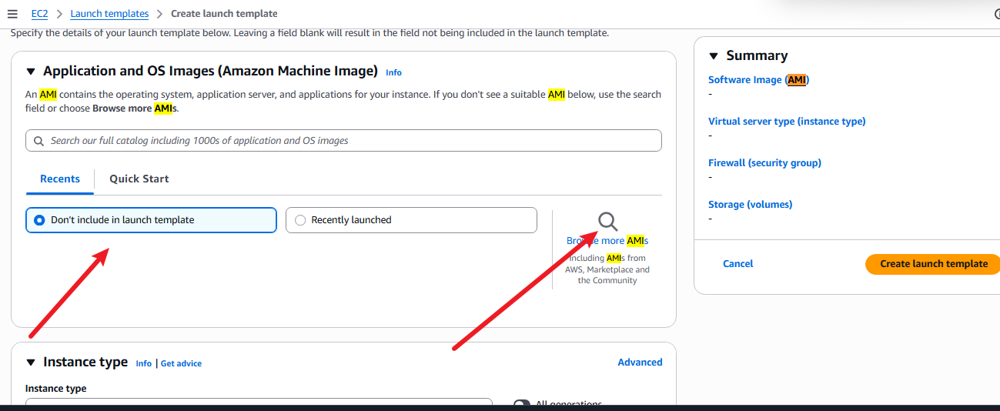

# AMI

AMI (**Amazon Machine Image**) é uma imagem utilizada como modelo para criar instâncias EC2. Ela contém as informações necessárias para inicializar uma instância, como o sistema operacional, softwares, configurações e volumes associados.

As AMIs podem ser consideradas **Golden Images**, ou seja, imagens previamente configuradas que servem como padrão para criar novas instâncias.

> **Importante:** a AMI é um recurso **regional**. Uma AMI criada em uma região não fica automaticamente disponível em outra. Caso seja necessário utilizá-la em outra região, é preciso copiá-la para essa região.

## Por que usar uma AMI?

Imagine o seguinte cenário:

Você possui uma EC2 totalmente configurada, com sistema operacional, softwares, configurações e outros recursos necessários para sua aplicação.

Agora você precisa criar outras instâncias exatamente com essa mesma configuração.

Você não vai configurar tudo manualmente novamente.

Nesse caso, você pode criar uma **AMI a partir da instância existente** e utilizá-la como modelo para criar novas instâncias EC2.

### O que uma AMI pode conter?

De forma simplificada, uma AMI pode representar:

- Sistema operacional (Linux, Windows etc.);
- Softwares instalados;
- Configurações do sistema;
- Arquivos e dados presentes nos volumes incluídos na imagem;
- Informações necessárias para inicializar a instância;
- Um ou mais snapshots dos volumes EBS utilizados pela imagem.

> **Importante:** não confunda AMI com Snapshot.  
> O **Snapshot** é uma cópia de um volume EBS.  
> A **AMI** é um modelo utilizado para criar uma nova instância EC2 e pode utilizar snapshots dos volumes EBS como parte de sua definição.

---

# Launch Template


O **Launch Template** é responsável por reunir as configurações necessárias para criar e iniciar uma instância EC2.

Ele funciona como uma espécie de **receita de configuração** para a EC2, permitindo padronizar e automatizar a criação de instâncias.

Um Launch Template pode definir, por exemplo:

- Qual **AMI** será utilizada;
- Tipo da instância (t2.micro, t3.large etc.);
- Par de chaves (**Key Pair**);
- VPC e Subnet;
- Security Groups;
- Configurações de rede;
- IAM Role;
- User Data;
- Configurações de armazenamento EBS;
- Tags;
- Outras configurações da instância.

### Relação entre AMI e Launch Template

Podemos pensar da seguinte forma:

**AMI = o que a máquina terá**

**Launch Template = como a máquina será criada**

Exemplo:

```text
AMI
 ├── Linux
 ├── Docker
 ├── Nginx
 └── Configurações da aplicação

        ↓

Launch Template
 ├── AMI
 ├── Tipo: t3.micro
 ├── Key Pair
 ├── VPC/Subnet
 ├── Security Group
 ├── IAM Role
 └── User Data

        ↓

     EC2
```

