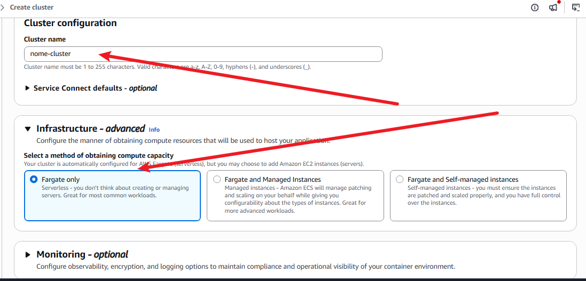

# Cluster

É o ambiente lógico aonde os containers serão executados.
(Pense nele como uma caixa aonde tudo que for referente a tal serviço e configurações roda dentro)
- Ele pode utilizar para funcionar tanto uma EC2 quanto um Fargate(Mais comum e moderno é o Fargate)

