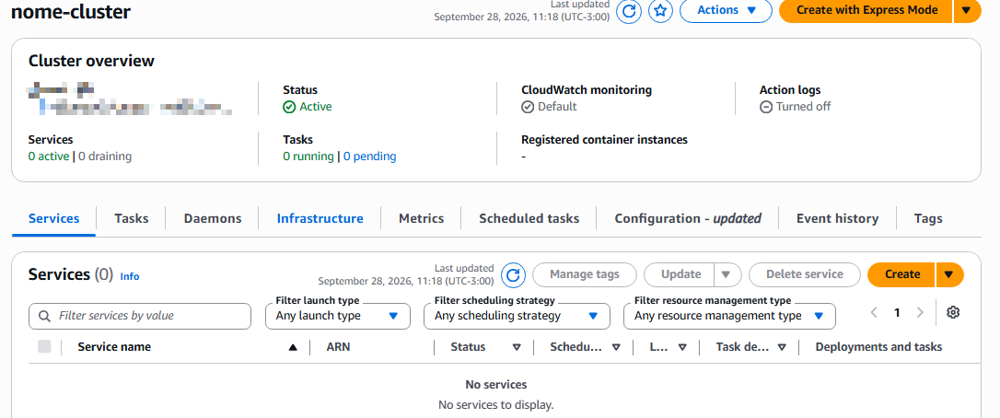

# SERVICE

É o recurso responsável por manter uma aplicação em execução
(É o gerenciamento que mantém tudo de pé).

RESPONSABILIDADES:
- Auto Scalling de Tasks
- Health Checks
- Integrar com Load Balancers
- Deploy
- Quantas Tasks irão rodar (Ex: Desired = 3)
- Parte de VPC e afins

IMPORTANTE:
- Dentro de um cluster pode ter vários services, como exemplo:

CLUSTER PROD
- frontend-service
- backend-service
- auth-service

CLUSTER DEV
- frontend-service
- backend-service
- auth-service

Cada service controla seu grupo de Tasks.

