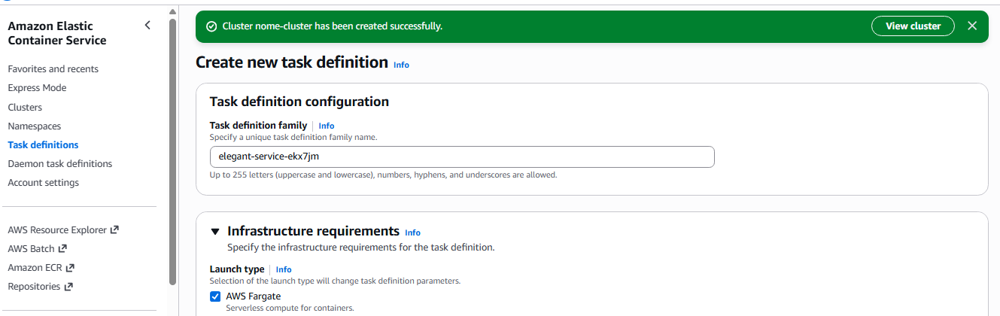

# TASK DEFINITION

É o modelo de execução da aplicação.
Enquanto o Service mantem a aplicação de pé, este recurso fala o que a aplicação será.

RESPONSABILIDADES:
- Definir imagem Docker
- CPU utilizada 
- Memoria utilizada
- Logs
- Variaveis de ambiente
- Volumes
- Permissoes IAM
- Cloud Watch
- Tipo de infra (Fargate / EC2)
- Role de execução e afins
- Nome do container
- Namespaces
  