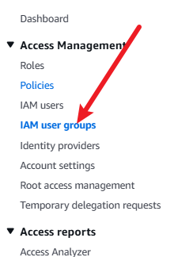
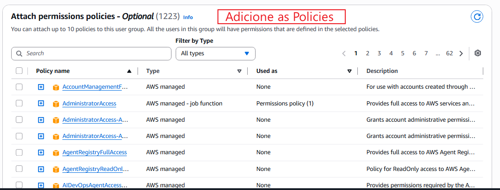

## IAM Groups

Os Grupos de Usuários no AWS IAM são coleções de usuários que facilitam a gestão de permissões em escala. Em vez de atribuir políticas de acesso individualmente para cada pessoa, você anexa as políticas ao Grupo e os usuários adicionados a ele herdam automaticamente todas as suas permissões.

**Vantagens do uso de Grupos:**
- **Administração Centralizada:** Simplifica a concessão e revogação de acessos.
- **Escalabilidade:** Evita retrabalho manual na entrada ou mudança de escopo de novos colaboradores.
- **Princípio do Menor Privilégio por Função (Job Function):** Organiza permissões de acordo com o papel desempenhado na empresa (ex: Desenvolvimento, Financeiro, Infraestrutura).

## Como criar um grupo:

 
 
 

 **Obs**: Para atrelar uma nova permissão após criar o grupo, basta seguir o passo a passo.
 Caminho: IAM Console ➔ User groups ➔ [Nome do Grupo] ➔ Aba Permissions ➔ Add permissions ➔ Attach policies.

## Esquema visual IAM Groups

```mermaid
graph TD
    subgraph "Grupo: Desenvolvedores (Devs)"
        P_DEV["Políticas Anexadas:<br>- AmazonEC2FullAccess<br>- AmazonECS_FullAccess<br>- AmazonEC2ContainerRegistryFullAccess"]
        U_Ryan["Usuário: Ryan"]
        U_Pedro["Usuário: Pedro"]
    end

    subgraph "Grupo: Financeiro"
        P_FIN["Políticas Anexadas:<br>- AWSBillingReadOnlyAccess"]
        U_Ana["Usuário: Ana"]
    end

    P_DEV -. Herda Permissões .-> U_Ryan
    P_DEV -. Herda Permissões .-> U_Pedro
    P_FIN -. Herda Permissões .-> U_Ana

    classDef grupo fill:#232f3e,stroke:#ff9900,stroke-width:2px,color:#fff;
    classDef usuario fill:#ffffff,stroke:#232f3e,stroke-width:1px,color:#000;
    classDef politica fill:#e6f2ff,stroke:#0066cc,stroke-width:1px,color:#000;

    class P_DEV,P_FIN politica;
    class U_Ryan,U_Pedro,U_Ana usuario;