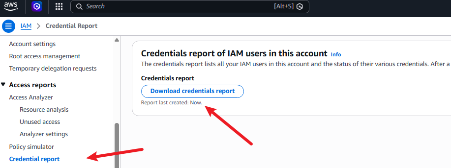

# Credential report

Está é a ferramenta responsável por gerar um relatorio (Simples) sobre as contas e suas especificações no formato .csv.

user,arn,user_creation_time,password_enabled,password_last_used,password_last_changed,password_next_rotation,mfa_active,access_key_1_active,access_key_1_last_rotated,access_key_1_last_used_date,access_key_1_last_used_region,access_key_1_last_used_service,access_key_2_active,access_key_2_last_rotated,access_key_2_last_used_date,access_key_2_last_used_region,access_key_2_last_used_service,cert_1_active,cert_1_last_rotated,cert_2_active,cert_2_last_rotated