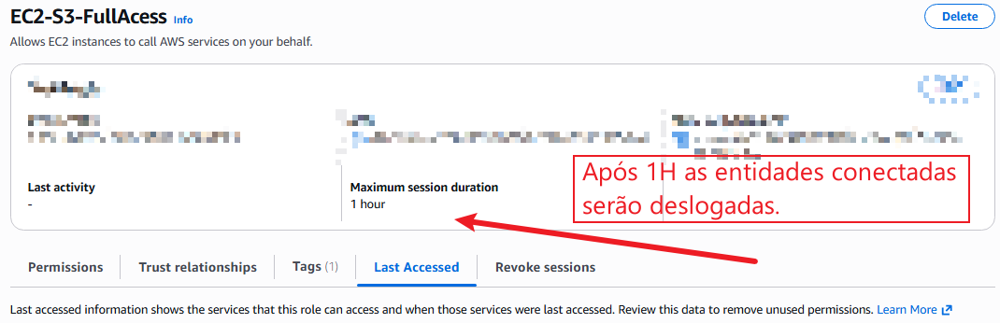

## IAM Role

**AWS IAM Role (Perfil do IAM)** é a entidade da AWS responsável por conceder **acessos temporários**. Ao contrário de um Usuário do IAM, a Role não possui credenciais de longo prazo (como senha ou chave de acesso fixa). Em vez disso, ela fornece credenciais temporárias renováveis via serviço **AWS STS** (*Security Token Service*).

#### Quem pode assumir uma IAM Role?

* **Serviços AWS:** Instâncias EC2, AWS Lambda, ECS Tasks, AWS Glue, etc.
* **Usuários do IAM:** Usuários da própria conta que precisam elevar privilégios temporariamente.
* **Usuários de Outras Contas AWS:** Acesso entre contas (*Cross-Account Access*).
* **Identidades Federadas:** Usuários autenticados via Single Sign-On (Okta, Azure AD, Google).
* **Aplicações e Pipelines CI/CD:** Servidores *on-premises* ou esteiras externas (GitHub Actions, GitLab CI via OIDC).

---

#### Comparativo: IAM User vs IAM Role

| Característica | IAM User | IAM Role |
| --- | --- | --- |
| **Identidade** | Permanente (longo prazo) Tem senha | Temporária (assumida via `AssumeRole`) Não tem senha |
| **Credenciais** | Senha e/ou Access Keys fixas | Credenciais temporárias com tempo de expiração |
| **Pertence a Grupos?** | Sim | Não |
| **Casos de Uso** | Pessoas (ex: `ryan`) | Serviços, automações e acesso entre contas |


O usuário representa uma identidade permanente (tem senha, etc.); ele pertence a grupos que possuem suas políticas ou pode ter políticas exclusivas.

A role representa uma identidade assumível e temporária (não tem senha). Ela pode ser assumida.

Uso Típico:

User: Usuários normais (Ex.: Ryan)

Role: Serviços, aplicações/acesso temporário, etc. (Dê mais exemplos)

Analogia:
---
User:

Ryan
 │
 ├── Password
 ├── MFA
 └── Permissions

Role:

EC2
 │
 └── AssumeRole
       ↓
IAM Role
       ↓
Permissions
  
#### Estrutura Fundamental: As Duas Partes de uma Role

Uma IAM Role é composta por dois blocos de políticas essenciais:

```text
                             IAM ROLE
                                │
              ┌─────────────────┴─────────────────┐
              │                                   │
        Trust Policy                      Permissions Policy
              │                                   │
      "Quem pode assumir?"               "O que pode fazer?"
              │                                   │
              ▼                                   ▼
        ec2.amazonaws.com                   s3:GetObject

```

1. **Trust Policy (Política de Confiança):** Define o **Principal** (quem tem autorização para assumir esta Role).
2. **Permissions Policy (Política de Permissões):** Define **quais ações e recursos** a entidade terá acesso após assumir a Role.

---

#### Casos de Uso Práticos e Diagramas

##### 1. Automação CI/CD (GitHub Actions ➔ AWS via OIDC)

Elimina a necessidade de salvar `AWS_ACCESS_KEY_ID` fixas nos segredos do GitHub.

```text
GitHub Actions ──( OIDC )──> IAM Role (AWS) ──> Recursos (S3, EC2, ECR)

```

##### 2. Acesso entre Contas (*Cross-Account Access*)

Permite que recursos da Conta A operem na Conta B com segurança.

```text
Conta A (Aplicação) ──( AssumeRole )──> Role na Conta B ──> Recursos na Conta B

```

---

#### Diferença Prática entre Entidades IAM

* **User (Usuário):** A identidade pessoal (ex: `Ryan`).
* **Group (Grupo):** Conjunto de usuários (ex: `DevOps`).
* **Policy (Política):** O documento em JSON com a regra (ex: `Allow: s3:GetObject`).
* **Role (Perfil):** O "chapéu" ou crachá temporário que pode ser assumido quando necessário.

> **Regra de Ouro:** Utilize uma IAM Role sempre que precisar conceder permissões à AWS **sem expor ou armazenar credenciais permanentes**.

---


### ROLE X POLICY

**Policy** - São as regras de permissão (Define o que pode ser feito)
Ex:
{
  "Effect": "Allow",
  "Action": "s3:GetObject",
  "Resource": "arn:aws:s3:::meu-bucket/*"
}


**Role** - Recebe estas permissoes

Ex: A instancia EC2 precisa acessar um GetObject de um S3 e ele assume uma Role que tem dentro dela a Policy de GetObject do S3 em questão.

# Role = Tem tempo de expiração.

 
