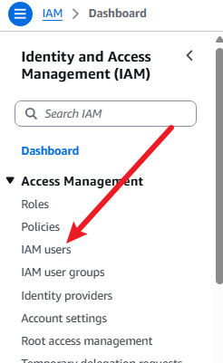
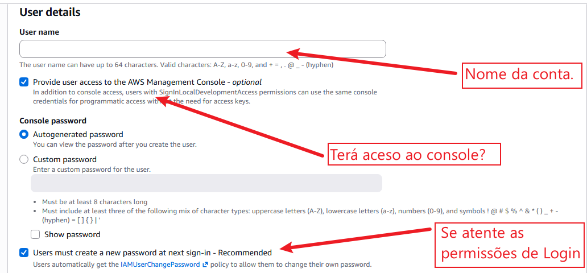
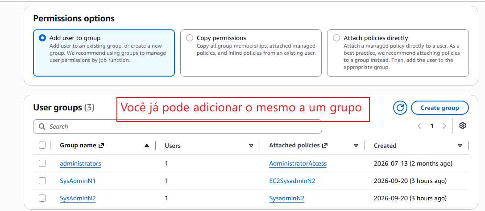
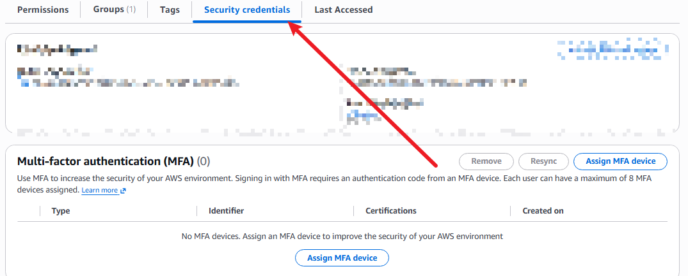

# IAM User

O AWS IAM (Identity and Access Management) permite criar e gerenciar usuários, que representam pessoas ou serviços que precisam interagir com seus recursos na AWS.

**O que é um Usuário do IAM?**

É uma entidade criada dentro da sua conta AWS com permissões específicas. Os usuários podem acessar o ambiente de três formas principais:

- Console de Gerenciamento da AWS: Acesso visual via navegador (Web).
- AWS CLI (Interface de Linha de Comando): Interação via terminal.
- Aplicações e SDKs: Acesso programático por código de software.

## Como Criar um Usuário no IAM (Passo a Passo)

## Credenciais 
Acessando o perfil do usuário e navegando até a aba Credenciais de segurança (Security credentials), é possível gerenciar todos os métodos de autenticação do usuário IAM.

Métodos de Acesso e Credenciais
- MFA (Multi-Factor Authentication): Camada adicional de segurança obrigatória para acesso ao Console e APIs.
  
- Chaves de Acesso (Access Keys): Conjunto de Access Key ID e Secret Access Key usado para autenticação via AWS CLI, SDKs e chamadas diretas de API.
  
- Chave Pública SSH (SSH Public Keys for AWS CodeCommit): Permite a conexão e autenticação segura via linha de comando em repositórios Git gerenciados no AWS CodeCommit.
  
- Credenciais do Git para o AWS CodeCommit: Usuário e senha específicos para realizar operações Git (clone, push, pull) em repositórios CodeCommit via HTTPS.

Importante (Políticas de Senha e Login):
Certifique-se de configurar e respeitar as Políticas de Senha da Conta (Account Password Policy), que definem requisitos mínimos como tamanho da senha, complexidade, expiração e rotação periódica.

## Grupos e politicas:

Mesmo após a criação de um Usuário do IAM, é possível alterar, adicionar ou remover suas permissões a qualquer momento, vinculando políticas diretamente ao usuário ou associando-o a grupos de usuários.

Passo a Passo: Adicionando Permissões a um Usuário Existente

1. No menu do IAM, vá em Usuários (Users) e selecione o usuário desejado.
   
3. Na aba Permissões (Permissions), clique no botão Adicionar permissões (Add permissions).
   
5. Adicionar usuário ao grupo (Add user to group) — Recomendado: Selecione um ou mais grupos existentes que já possuam as políticas necessárias.
   
7. Anexar políticas diretamente (Attach policies directly): Busque e selecione as políticas gerenciadas pela AWS ou personalizadas que deseja aplicar diretamente a este usuário.
   
9. Revise e Confirme:
    
11. Clique em Avançar (Next), revise as alterações e confirme clicando em Adicionar permissões (Add permissions).

## Auditoria

**AWS IAM Last Accessed (Access Advisor)** é uma ferramenta de auditoria que mostra quando um serviço ou ação foi utilizado pela última vez por um usuário ou perfil (*Role*).

* **Objetivo:** Aplicar o **Princípio do Menor Privilégio**, identificando permissões acumuladas e sem uso.
* **Benefício:** Permite remover acessos inativos com segurança, reduzindo a superfície de ataque sem quebrar aplicações.
* **Caminho de acesso:** `IAM` ➔ `Usuários/Roles` ➔ `[Selecione a entidade]` ➔ Aba `Access Advisor`.

