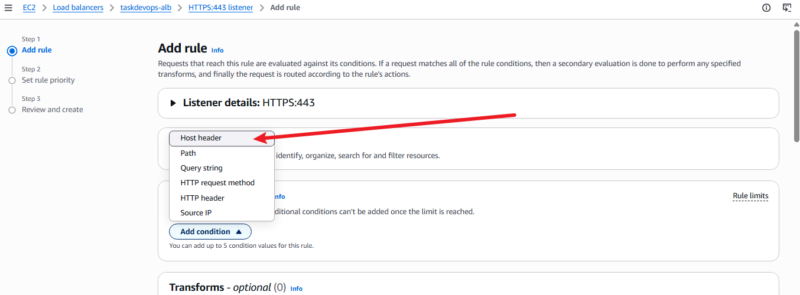
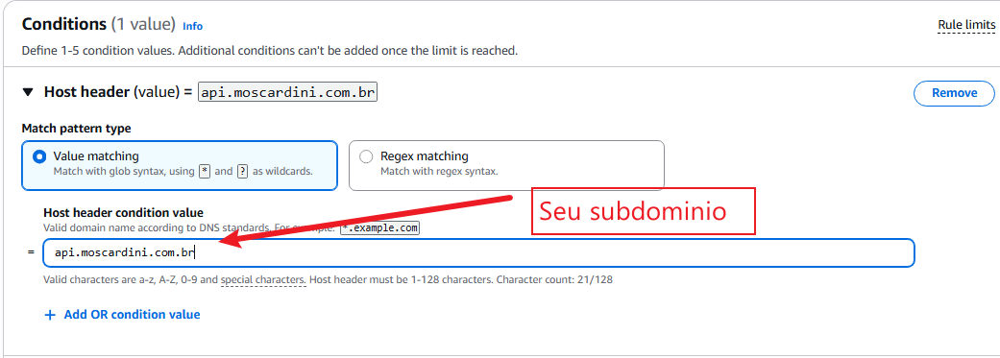
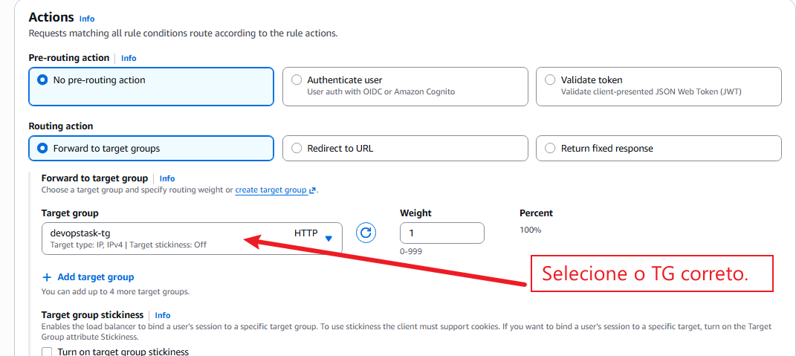
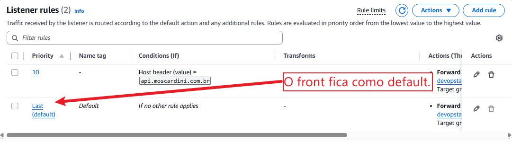

# Host Header (ALB)
Quando temos uma API e um front-end, geralmente o front-end fica em **dominio.com.br** e a API em **api.dominio.com.br**. Para fazermos o ALB entender que as requisições que chegam nas portas 80 e 443 devem ser direcionadas para destinos diferentes com base no subdomínio acessado (evitando a criação de dois ALBs), podemos utilizar o roteamento por Host Header.

- Front-end Web: Acessível via dominio.com.br (e [www.dominio.com](https://www.dominio.com).br)
- API Backend: Acessível via api.dominio.com.br
```
                               ┌─── Host: dominio.com.br ─────> [ Target Group: Front-end ] ──> 
                               │
[ Cliente ] ──> [ ALB (443) ] ─┤
                               │
                               └─── Host: api.dominio.com.br ──> [ Target Group: API ] ────────> 
```

## Como fazer:
Primeiro de tudo você precisa de um dominio e subdominio com ACM configurado na provedora de DNS.







