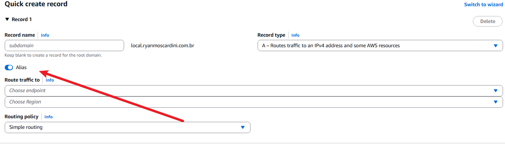
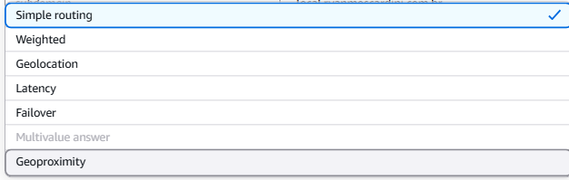

# ROUTE 53

Este é o serviço de DNS da AWS (Faz o mesmo papel da Cloudflare). Sua principal função é traduzir nomes de domínio em endereços IPs, permitindo que usuarios acessem aplicações utilizando nomes ao inves de IPs. 

## **Funcionalidades:**
**Balanceamento de DNS:**
 - Imagine duas regiões A e B, ele decide para qual enviar.

**Health Checks:**
 - Ele verifica se um servidor ainda responde (Está vivo).

**Alias (Muito importante):**

Um registro tipo A aponta para um IP.
Exemplo:
site.com.br A 186.249.34.150

Porém por padrão ele não pode apontar para uma "Escrita" e os serviços da AWS em sua grande maioria **não possuem IP fixo** eles apenas possuem um DNS fixo que sempre vai apontar para seu respectivo IP.
Ai fica a pergunta "Pq não criar um CNAME?", o ponto é que o CNAME só funciona para subdominios ex: "api.site.com" mas não funciona na raiz ex: "site.com". Pensando nisso, a AWS criou o alias. Quem acessa de fora pensa que está acessando o IP mas de forma interna a AWS faz o roteamento correto.

**OBSERVAÇÂO:**
  - A cloudflare também faz isso, basta colocar o @

Na Cloudflare você teria algo parecido com:
| Nome | Tipo  | Destino                               |
| ---- | ----- | ------------------------------------- |
| @    | CNAME | `d123.cloudfront.net`                 |
| www  | CNAME | `d123.cloudfront.net`                 |
| api  | CNAME | `meu-alb.sa-east-1.elb.amazonaws.com` |

## Dominio privado (Private Hosted Zone)
Utilizamos um dominio privado quando queremos organização e separação dentro de nossos ambientes (VPC + recursos privados).

**IMPORTNATE:**
  - Este dominio só existe dentro de sua VPC, a internet não consegue resolver o mesmo, então pode colocar o que quiser, você não precisa registrar.

**EXEMPLO:**
  - Imagine que atualmente suas EC2 acessam seu banco por "meubanco.abc123.sa-east-1.rds.amazonaws.com", até funciona, mas imagina que você possui um monte de serviços e cada um com um dns gigante, fica horrivel de administrar. O que você pode fazer?:

  - Cria uma Private Hosted Zone (ex: empresa.local) 
  - cria os registros apontando para os DNS (ex: db.empresa.local      meubanco.abc123.sa-east-1.rds.amazonaws.com)
  
VPC (10.0.0.0/16)
 ├── Private Hosted Zone: empresa.local
 │    └── Registro CNAME: db.empresa.local ──> meubanco.abc123.sa-east-1.rds.amazonaws.com
 │
 └── Recursos internos (EC2 / EKS)
      └── Acessam o RDS diretamente via "db.empresa.local"

## Politicas de roteamento
**Simple Routing:**
 - Permite rotear para apenas um recurso, ele sempre ouve o mesmo servidor.
 Exemplo: site.com - 172.16.0.1

**Failover:**
 - Ele verifica por meio de Health Checks a integridade dos recursos e caso um estiver fora ele rotea para o outro.

**Geolocalização:** 
 - Permite escolher os recursos locais que melhor atendam seus usuarios baseados em suas geolocalizacoes 
IMPORTANTE - Este recurso atua a nivel de país (Região).
<u>A propria AWS faz.</u>

**Geoproximidade:** 
 - Permite escolher os recursos locais que melhor atendam seus usuarios baseados em sua geoproximidade
IMPORTANTE - Este recurso atua a nivel local.
<u>Podemos informar o local.</u>

**Baseado em latencia:** 
 - Determina o roteamento baseado no recurso de menor latencia.
<u>(Não importa se o caminho é maior ou menor, ele só quer chegar mais rápido)</u>

**Baseado em IP:**
 - Determina o roteamento baseado nos blocos de rede (CIDR) e fazer os roteamentos baseados neles. (Pool de IPs e etc...)

**Resposta com vários valores:**
 - Permite que verifique a integridade de cada recurso (Só responde os que estão ok) ele não substitui o load balancer, ele complementa

