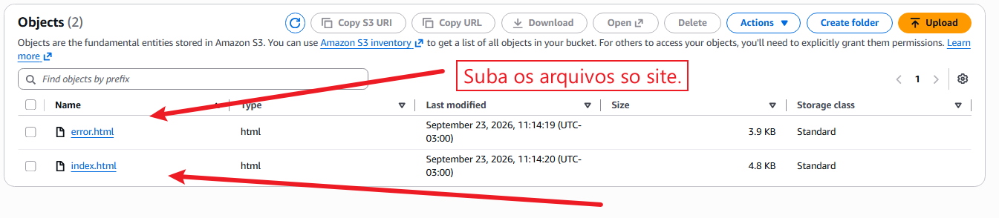
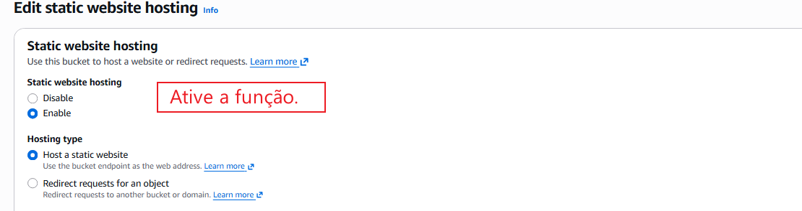
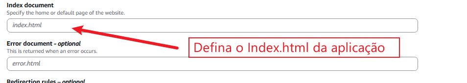
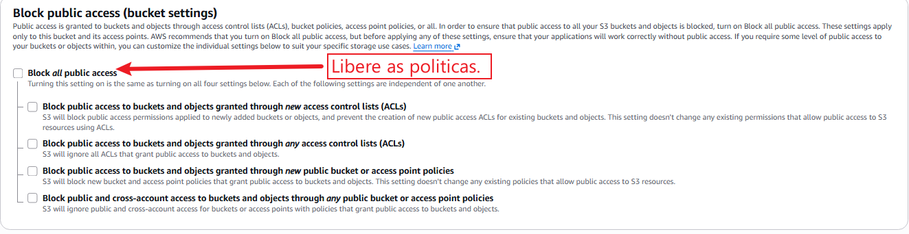

# Static website hosting

Este serviço é um recurso que a AWS disponibiliza em seus Buckets para que um **site estático** possa ser visivel para a Web.

**IMPORTANTE:**
Este recurso é considerado obsoleto e sem segurança, pelos seguintes motivos:

- Exposição do Bucket: É necessário expor o Bucket a toda Web (Remover Block public access (bucket settings).
- Sem suporte ao HTTPS (Possui somente HTTP).

O cenário ideal, é configurar um Cloudfront, pois assim o bucket fica privado e com SSL.

## Como fazer:

Com seu Bucket criado, é necessário fazer as seguintes configurações.

1. 
2. 
3. 
4. 
5. Adicione a policita correta 

```
{
	"Version": "2012-10-17",
	"Statement": [
		{
			"Sid": "web-site",
			"Effect": "Allow",
			"Principal": "*",
			"Action": "s3:GetObject",
			"Resource": cdn-da-sua-aplicação/*"
		}
	]
}
```
