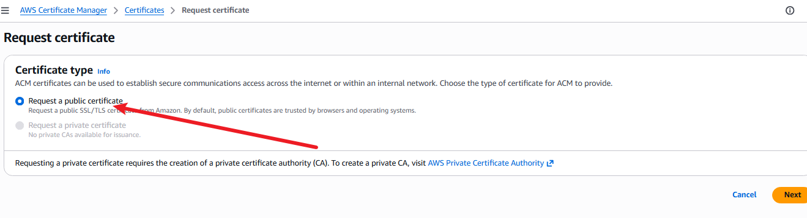
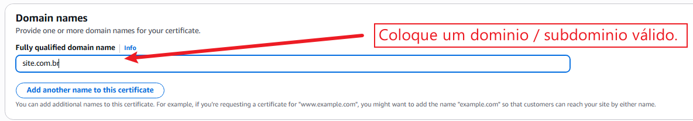
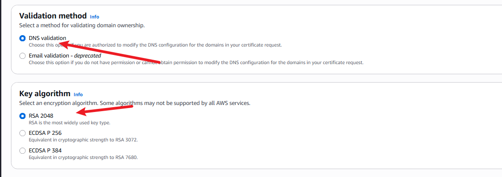
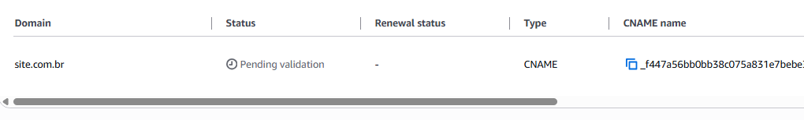

# AWS ACM

**O que é o ACM?**
É um serviço gerenciado para criar, gerenciar e renovar certificados SSL/TLS.Serve para criptografar o tráfego dos seus sites e aplicações na nuvem.

**Onde ele se aplica?**
- O ACM funciona de forma integrada com outros serviços da AWS que lidam com requisições externas, como:
- ALB / NLB (Balanceadores de Carga)
- Amazon CloudFront (Rede de distribuição de conteúdo/CDN)
- Amazon API Gateway

Ele não fica instalado dentro de uma instância EC2 e não faz parte da infraestrutura de rede da VPC (como sub-redes ou tabelas de rotas), embora proteja os recursos que estão conectados a eles.

## Custos:
Este é um serviço gratuito, o mesmo não gera custos.

## Como gerar um certificado ACM:

1. 

2. 

3. 

4. Após solicitar o request de um novo, o mesmo fica pendente de validação e tem que ser válidado em seu provedor / gerenciador de DNS (Route53, Cloudflare etc...).

   

Para validar basta adicionar os registros CNAME em seu provedor, abaixo segue um exemplo:
| Type | Name | Value |
| --- | --- | --- |
| CNAME | _f447a56bb0bb38c075a831e7bebe3ce0.site.com.br. | _3a51ed62fe13dcedb00c5adc8329bb1e.wzccmgtwzk.acm-validations.aws.pó |

Após isto, o certificado fica válido.