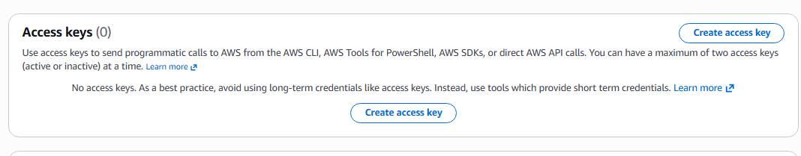

# Configuração CLI User

**O que é?**
Um CLI User (ou Usuário de Acesso via Linha de Comando) é um perfil de identidade criado no serviço de gerenciamento de acessos (AWS IAM) configurado especificamente para interagir com a nuvem de forma programática, em vez de usar a interface gráfica do navegador (AWS Management Console).

## Como configurar:
1.    Como primeiro passo, você deve criar uma Acess Keys para o usuario. **Nunca perca estas Acess Key ou compartilhe.**

2.  Agora precisamos onfigurar no terminal; segue comandos:

   

```
aws configure --profile seu_usuario
```

Abaixo segue as respostas para as perguntas que serão feitas:
```
AWS Acess Key ID [None]: Sua Acess Key
```

```
AWS Secret Acess Key [None]: Sua Private Key
```

```
Default region name [None]: Sua região (Da para ver na tela inicial da console)
```

```
Default output format [None]: json
```