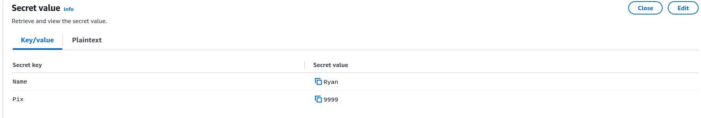
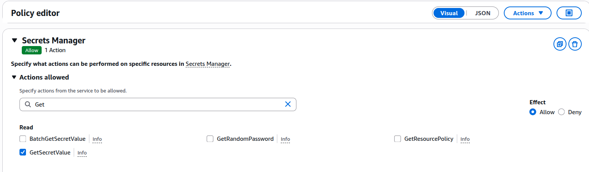
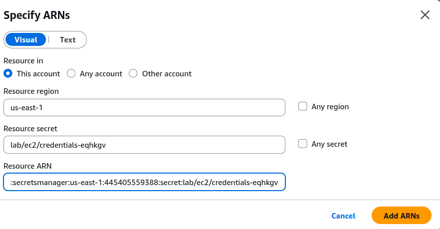
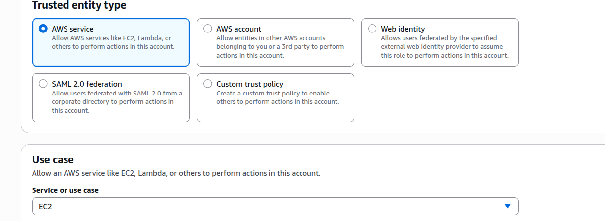

# AWS Secrets Manager

O AWS Secrets Manager é um serviço para armazenar, proteger, recuperar e, quando necessário, rotacionar informações sensíveis, como:
- Senhas de banco de dados
- API Keys
- Tokens
- Credenciais de serviços
- Chaves de aplicações
- Credenciais de terceiros

A ideia principal é simples:

Sua aplicação não precisa ter a senha dentro do código ou das variáveis de configuração. Ela busca o segredo no Secrets Manager quando precisa.

A própria AWS recomenda o Secrets Manager justamente para evitar credenciais codificadas diretamente nas aplicações.

**Exemplo:** 

```
EC2
 │
 │ possui
 ▼
IAM ROLE
 │
 │ GetSecretValue
 ▼
SECRETS MANAGER
 │
 │
 ▼
Secret (senha, API Key, token...)

EC2 → IAM Role autoriza → Secrets Manager → retorna o Secret
```

## Como criar uma do 0 + Exemplo com EC2

1. Crie sua Secret (Guarde a ARN):


2.  Crie uma police personalizada (Opicional mas recomendado)

   

3. Especifique a ARN

     

4.    Crie uma Role com sua Police



Após isso, atrele ao serviço que você deseja. No exemplo, atrelei o mesmo a uma EC2 com um código que busca a secret e exibe.

```
ubuntu@ip-172-31-22-49:~$ python3 teste.py
Conteúdo:
{"Name":"Ryan","Pix":"1691759831"}
```

## Observação

O AWS Secrets Manager é um serviço pago, cobrando principalmente pelo número de secrets armazenados e pelas chamadas realizadas à API. Para laboratórios, manter poucos secrets e evitar recursos desnecessários ajuda a controlar os custos.

Outro detalhe importante é que, ao excluir um Secret, a AWS normalmente utiliza um período de recuperação de 7 a 30 dias. Durante esse período, o Secret fica marcado para exclusão, mas ainda pode ser recuperado. Também existe a opção de exclusão imediata e irreversível (ForceDeleteWithoutRecovery), quando realmente necessário.