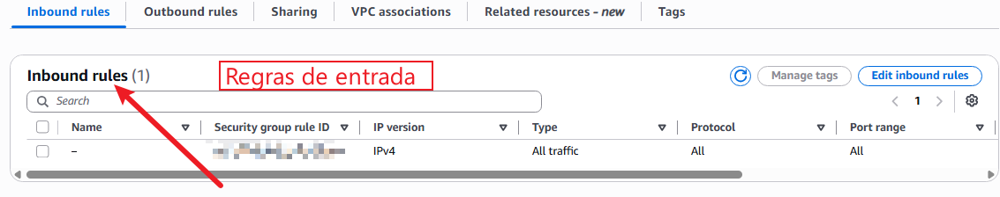
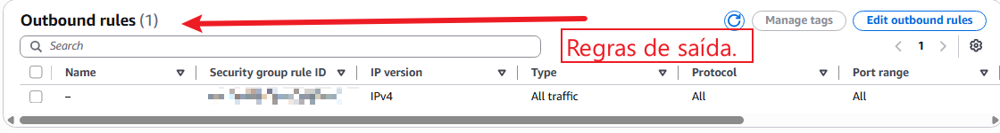

# SECURITY GROUPS

Este recurso é um firewall virtual e seu serviço é controlar o trafego de entrada e saida.
**IMPORTANTE:**
- Este é um recurso Stateful. Ex: Você envia uma requisição para um site, a resposta do site não precisa ser filtrada como permissiva no firewall.
- Todas regras criadas são PERMISSIVAS. Por padrão, toda requisição é negada, no security group você só libera.
- Todo trafego de saida é liberado por padrão (Se atentar a isso, pois pode gerar problemas).
- Você pode liberar por portas ou por intervalo de portas.

**Regras de entrada:** 
- São o que a Internet pode solicitar do seu serviço.
- Ex: Acessar o SSH de uma EC2. Como o acesso é por fora, a regra é colocada no Inbound.

**Regras de Saída:**
- São o que o seu serviço pode solicitar para a internet.
- Ex: Você está conectado em uma EC2 e precisa acessar o Youtube. Como a requisição sai de dentro, precisa liberar para a pessoa acessar.
  
